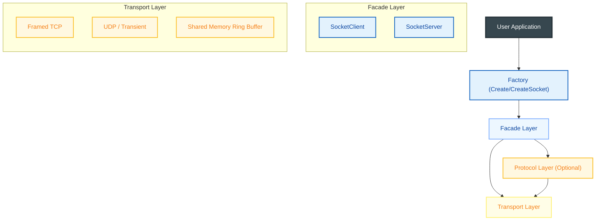

# Architecture

`safe-socket` is designed with a layered architecture to separate concerns between high-level socket operations, protocol logic, and low-level transport mechanisms. This allows for modularity and easy extension (e.g., adding new transports or protocols without breaking the API).

## High-Level Overview

## Layers

### 1. Factory Layer (`src/factory`)
The entry point for the library.
-   **Responsibility**: Validates inputs, creates `SocketProfile`s, initializes `SocketConfig`, and instantiates the appropriate Facade.
-   **Key Functions**: `Create` (simplified), `CreateSocket` (advanced).

### 2. Facade Layer (`src/facade`)
Implements the high-level `interfaces.Socket` API (`Open`, `Close`, `Send`, `Receive`, `Accept`).
-   **SocketClient**: Manages the client lifecycle. Handles connection establishment (`Open`) and data flow.
-   **SocketServer**: Manages the server lifecycle. Handles listening (`Listen`) and accepting connections (`Accept`).
-   **Connection Wrappers**:
    -   `HandshakeConnection`: Wraps a transport and attaches the peer's Identity (from Hello Protocol).
    -   `EnvelopedConnection`: Wraps a generic (UDP) transport to handle per-packet Encapsulation/Decapsulation transparently.

### 3. Protocol Layer (`src/protocol`)
Defines how data is structured or handshaked *above* the transport but *below* the application.
-   **HelloProtocol**: Implements a handshake exchanging `HelloMsg` (Name, IP, Host).
    -   **TCP/SHM**: Performed once at connection start.
    -   **UDP**: "Stateless Envelope" mode wraps *every* packet.

### 4. Transport Layer (`src/transports`)
Handles the low-level I/O.
-   **Interface**: `interfaces.TransportConnection` (Read, Write, Close, SetDeadline).
-   **Implementations**:
    -   **FramedTCP**: Uses `net.TCPConn`. adds 4-byte Header Framing for message boundaries. Optimized with buffers and "hot path" deadline checks.
    -   **UDP**: Uses `net.UDPConn`. Unreliable, unordered.
    -   **SHM**: Uses Memory Mapped Files (`mmap`) with a Ring Buffer and Spin-Wait synchronization for ultra-low latency IPC.

## Key Concepts

### Deadline Management
Deadlines are handled at two levels:
1.  **Configuration**: A `Deadline` on `SocketConfig` sets the initial timeout for new server connections (preventing slow-loris attacks or stalled handshakes).
2.  **Dynamic**: `SetDeadline` methods on the Socket interface allow per-operation control at the application level. To optimize performance, the TCP transport does not refresh deadlines on every call automatically; it relies on explicit user intent or the initial config.

### Profile System
Configuration is driven by `SocketProfile`, which dictates:
-   **Transport**: TCP, UDP, SHM.
-   **Protocol**: Hello, None.
-   **Behavior**: Timeout durations, buffer sizes (internal defaults).
