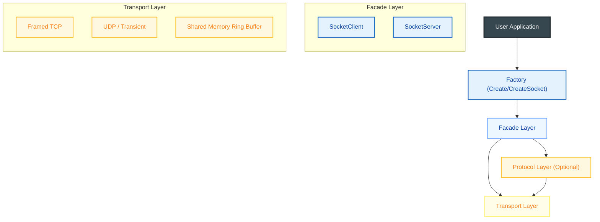

# Architecture

`safe-socket` is designed with a layered architecture to separate concerns between high-level socket operations, protocol logic, and low-level transport mechanisms. This allows for modularity and easy extension (e.g., adding new transports or protocols without breaking the API).

## High-Level Overview

```mermaid
flowchart TD
    %% Styles
    classDef core fill:#e3f2fd,stroke:#1565c0,stroke-width:2px,color:#0d47a1;
    classDef net fill:#fff8e1,stroke:#fbc02d,stroke-width:2px,color:#f57f17;
    
    %% Application Node Styling
    style User fill:#37474f,stroke:#263238,stroke-width:3px,color:#ffffff

    User[User Application] --> Factory["Factory (Create/CreateSocket)"]:::core
    Factory --> Facade[Facade Layer]:::core
    
    subgraph Facade Layer
        direction TB
        Client[SocketClient]:::core
        Server[SocketServer]:::core
    end
    style Facade fill:#edf7ff,stroke:#82b1ff,stroke-width:2px,color:#0d47a1
    
    Facade --> Protocol["Protocol Layer (Optional)"]:::net
    Facade --> Transport[Transport Layer]:::net
    Protocol --> Transport
    
    subgraph Transport Layer
        direction TB
        TCP[Framed TCP]:::net
        UDP[UDP / Transient]:::net
        SHM[Shared Memory Ring Buffer]:::net
    end
    style Transport fill:#fffde7,stroke:#fff176,stroke-width:2px,color:#f57f17
```

## Layers

### 1. Factory Layer (`src/factory`)
The entry point for the library.
-   **Responsibility**: Validates inputs, creates `SocketProfile`s, initializes `SocketConfig`, and instantiates the appropriate Facade. Inject defaults for ultra-responsiveness (Fail-Fast model).
-   **Key Functions**: `Create` (simplified), `CreateWithConfig` (advanced).

### 2. Facade Layer (`src/facade`)
Implements the high-level `interfaces.Socket` API (`Open`, `Close`, `Send`, `Receive`, `Accept`).
-   **SocketClient**: Manages the client lifecycle. Handles connection establishment (`Open`) and data flow.
-   **SocketServer**: Manages the server lifecycle. Handles listening (`Listen`) and accepting connections (`Accept`).
-   **Connection Wrappers**:
    -   `HandshakeConnection`: Wraps a transport and attaches the peer's Identity (from Hello Protocol).
    -   `EnvelopedConnection`: Wraps a generic (UDP) transport to handle per-packet Encapsulation/Decapsulation transparently.

### 3. Protocol Layer (`src/protocol`)
Defines how data is structured or handshaked *above* the transport but *below* the application.
-   **HelloProtocol**: Implements a handshake exchanging `HelloMsg` (Name, IP, Host).
    -   **TCP/SHM**: Performed once at connection start.
    -   **UDP**: "Stateless Envelope" mode wraps *every* packet.

### 4. Transport Layer (`src/transports`)
Handles the low-level I/O.
-   **Interface**: `interfaces.TransportConnection` (Read, Write, Close, SetDeadline).
-   **Implementations**:
    -   **FramedTCP**: Uses `net.TCPConn`. adds 4-byte Header Framing for message boundaries. Optimized with buffers and "hot path" deadline checks.
    -   **UDP**: Uses `net.UDPConn`. Unreliable, unordered.
    -   **SHM**: Uses Memory Mapped Files (`mmap`) with a Ring Buffer and Spin-Wait synchronization for ultra-low latency IPC.

## Key Concepts

### Deadline Management

Deadlines are handled at two levels:
1.  **Aggressive Defaults**: To ensure local clusters detect failures instantly, the library defaults to **500ms** (network) or **200ms** (local) timeouts for both handshakes and data operations.
2.  **Activity-Refresh Model**: The library uses an "activity-refresh" model. Setting a `Deadline` on `SocketConfig` establishes a window of inactivity. Every successful `Read`, `Write`, or `ReadMessage` operation automatically pushes the absolute deadline forward by this duration.
3.  **Heartbeat Safety Ratio (2.5x)**: To prevent connections from timing out during idle periods, a heartbeat is automatically scheduled at a `Deadline / 2.5` interval. This ensures at least 2 heartbeat attempts are made before any timeout can occur.
4.  **Adaptive Thresholds**: Heartbeats are intelligently disabled for ultra-responsive scenarios to minimize overhead:
    -   **Networking (TCP/UDP)**: Disabled if Deadline < 300ms.
    -   **Local (127.0.0.1)**: Disabled if Deadline < 150ms.
    -   **SHM**: Disabled if Deadline < 50ms.
5.  **Explicit Control & Dynamic Updates**: `SetIdleTimeout(duration)` allows runtime adjustments. Setting a `Deadline` of `0` triggers the responsive defaults (500ms/200ms).

### Profile System
Configuration is driven by `SocketProfile`, which dictates:
-   **Transport**: TCP, UDP, SHM.
-   **Protocol**: Hello, None.
-   **Behavior**: Timeout durations, buffer sizes (internal defaults).
