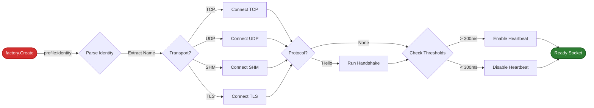

---
tags:
- '#ai/ignore'
- '#zone/3-fleet'
---
# Architecture Overview

`safe-socket` is built with a layered architecture to separate high-level operations, protocol logic, and low-level transport mechanisms. This modularity allows for easy extension, such as adding new transports or protocols without changing the public API.

## High-Level Workflow

The following diagram illustrates the lifecycle of a socket creation and configuration:

## Architectural Layers

### 1. Factory Layer (`src/factory`)
The primary entry point for the library.
- **Responsibility**: Validates inputs, parses profiles, initializes `SocketConfig`, and instantiates the appropriate Facade. 
- **Key Functions**: `Create` (simplified) and `CreateWithConfig` (advanced).

### 2. Facade Layer (`src/facade`)
Implements the high-level `interfaces.Socket` API (`Open`, `Close`, `Send`, `Receive`, `Accept`).
- **SocketClient/SocketServer**: Manage the lifecycle of client and server connections.
- **Connection Wrappers**:
    - `HandshakeConnection`: Manages the identity exchange.
    - `EnvelopedConnection`: Handles per-packet encapsulation for stateless protocols (e.g., UDP).
    - `ReliableConnection`: Layer for ensuring delivery (where applicable).

### 3. Protocol Layer (`src/protocols`)
Defines data structures and handshakes above the transport layer.
- **Hello Protocol**: Implements mutual identity exchange (Name, IP, Host).
- **Stateless Envelope**: Wraps UDP packets with identity metadata.

### 4. Transport Layer (`src/transports`)
Handles raw I/O operations.
- **Framed TCP**: Adds 4-byte message framing to TCP streams to prevent "short reads" and header loss.
- **UDP**: Standard connectionless transport.
- **Shared Memory (SHM)**: Ultra-low latency IPC using memory-mapped files and a Ring Buffer.
- **TLS**: Secure version of Framed TCP, supporting mutual TLS (mTLS) and custom CA validation.

## Core Concepts

### Deadline & Heartbeat Management
- **Activity-Refresh Model**: Every successful read or write operation automatically extends the connection's deadline.
- **Heartbeat Safety Ratio (2.5x)**: Heartbeats are scheduled at `Deadline / 2.5` to ensure at least two attempts before a timeout occurs.
- **Adaptive Thresholds**: Heartbeats are disabled if the deadline is too short to avoid excessive CPU overhead (e.g., < 300ms for network).

### Identity Propagation
- **Compound Profiles**: Uses the `profile:identity` syntax (e.g., `tcp-hello:my-service`) to inject service names into the handshake.
- **Unified Identity Access**: Peer information can be retrieved using the `safesocket.GetIdentity(conn)` helper.

### Performance Defaults
The library defaults to "Fail-Fast" timeouts to ensure system health in high-frequency environments:
- **Network**: 500ms
- **Local (127.0.0.1)**: 200ms
- **SHM**: 100ms
